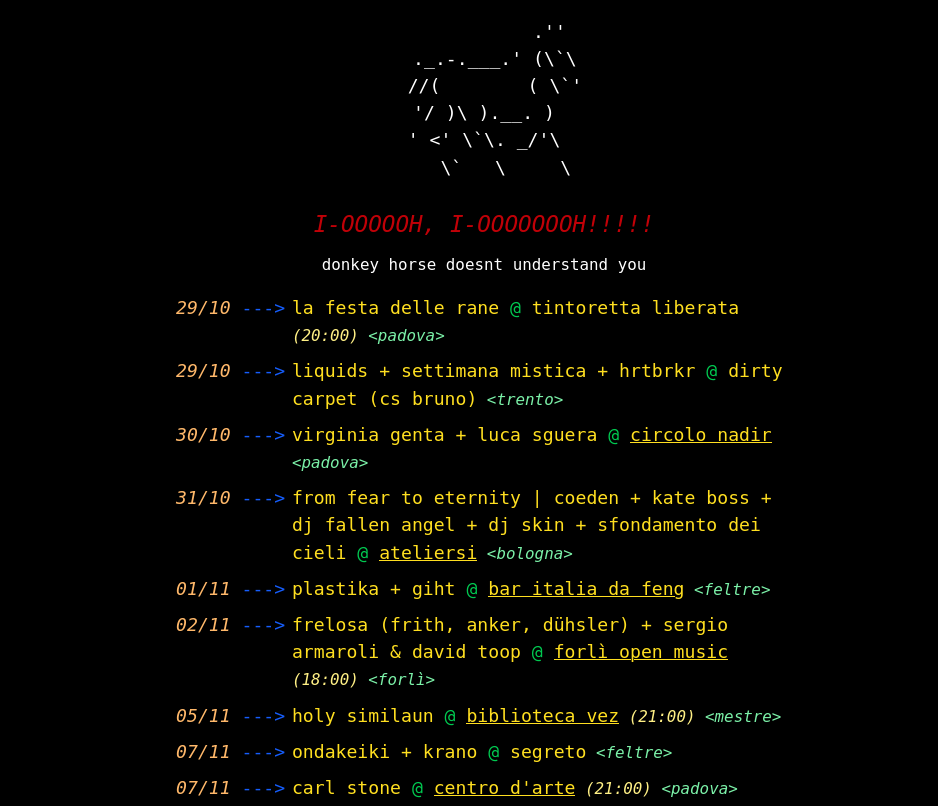

## donkey horse is a minimal event aggregator



list events, shows, diy and local stuff happening aroud you

see it online https://donkeyhorse.boo (mostly northen italy)

---

### run the project:

clone the repository

```bash
git clone https://github.com/skkskine/donkey-horse.git
cd donkey-horse
```

### method 1: npm

first of all, be sure to have a postgres db running

install the dependencies

```bash
npm install
```

add '.env' file in ./packages/fe

```
VITE_API_BASE_URL='http://localhost:<your-port>'
```

and 'env' in ./packages/be

```
PORT=<your-port>
DATABASE_URL='postgresql://<your-user>:<your-password>@localhost:5432/<your-database>'
JWT_SECRET='<your-super-secret-jwt-key-minimum-32-characters-long>'
JWT_EXPIRES_IN='7d'
VITE_API_BASE_URL='http://localhost:<frontend-port>'
EMAIL_USER=<smtp-user>
EMAIL_PASSWORD=<stmp-password>
EMAIL_HOST=<stmp-host>
EMAIL_PORT=<stmp-port>

```

start both frontend and backend

```
npm run dev
```

check the backend logs to get the default donkey horse user

go to http://localhost:your-port/login and then change the password from the account page

### method 2: docker compose

create a '.env' file in the root of the project

```
# db
POSTGRES_USER='<your-user>'
POSTGRES_PASSWORD='<your-password>'
POSTGRES_DB='<your-database>'

# be
BACKEND_PORT=<your-port>
JWT_SECRET='<your-super-secret-jwt-key-minimum-32-characters-long>'
JWT_EXPIRES_IN='7d'

# fe
FRONTEND_PORT=<your-port> #(usually 80)
VITE_API_BASE_URL='http://localhost:<frontend-port>'

#smtp
EMAIL_USER=<smtp-user>
EMAIL_PASSWORD=<stmp-password>
EMAIL_HOST=<stmp-host>
EMAIL_PORT=<stmp-port>
```

build and start the containers

```bash
docker compose up -d
```

check the backend container logs to get the default donkey horse user

go to http://localhost/login (or your-domain/login) and then change the password from the account page
